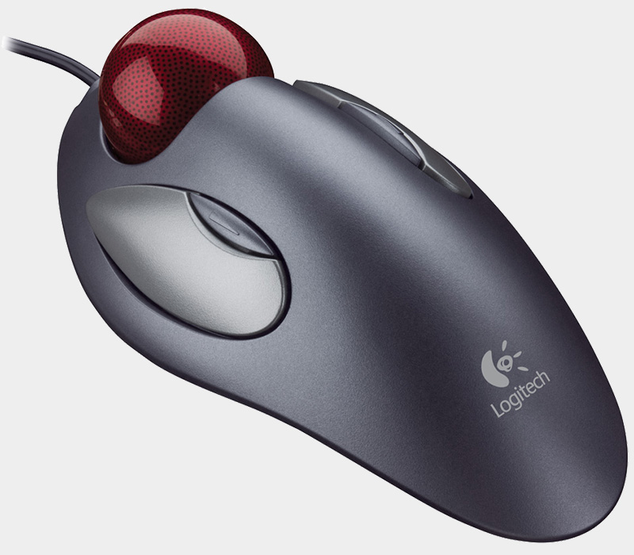

# Add scrolling to Logitech Marble Mouse

AutoHotKey script for add scrolling functionality to Logitech Marble Mouse trackball.  
Script remaps back and forward buttons (small buttons on the sides) to scrolling up and down.  

